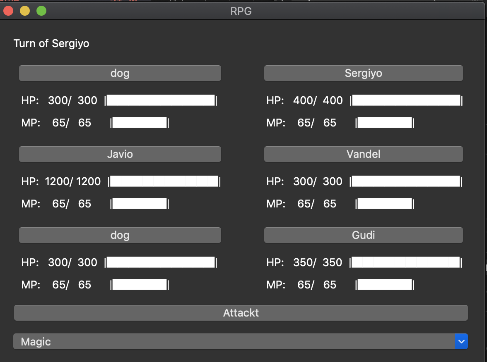

# MiniRPG
First approach to a small video game using Python and Qt5. This game is a battle simulator, where one user plays againts an AI using his mouse to click different buttons in order to perform different actions:

    

